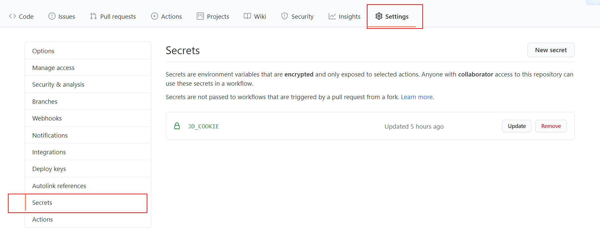
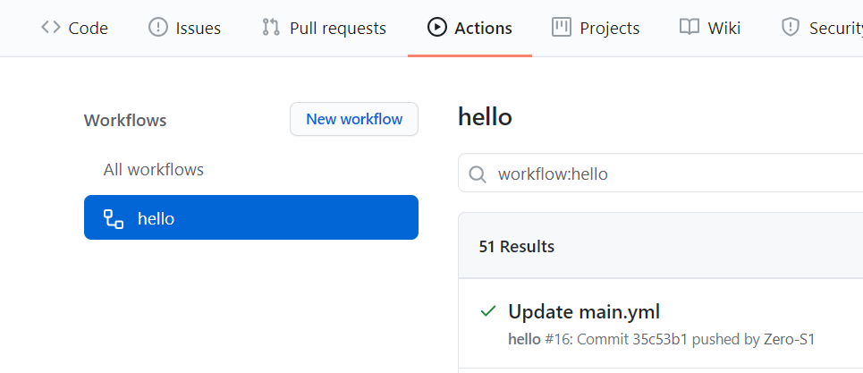
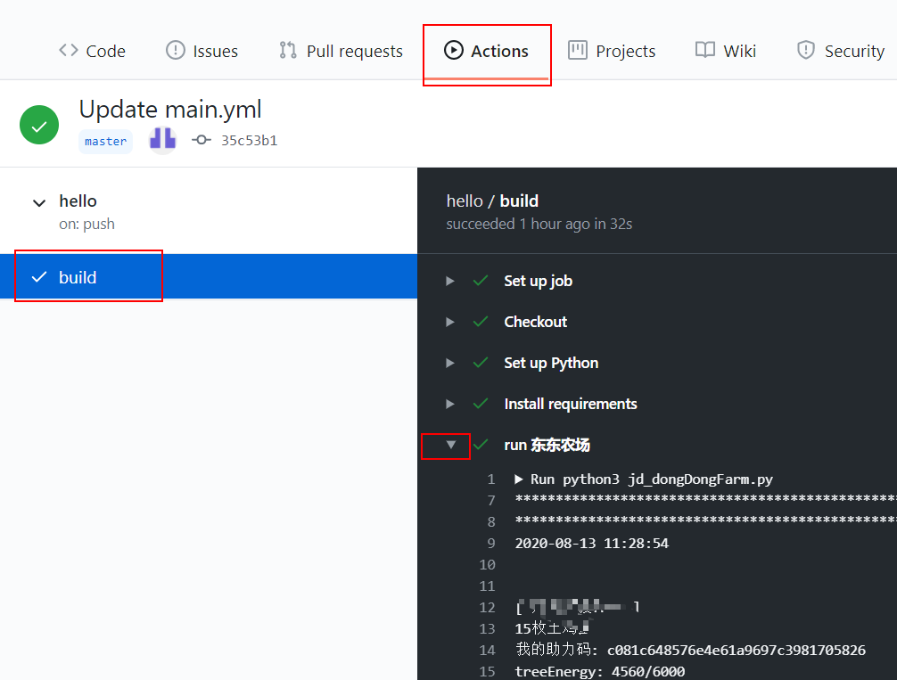

# 利用GitHub action自动运行脚本

简单介绍

## 主要流程

1. fork本项目

2. Settings - Secrets    填写账号信息，此处专用于保存私密信息

3. 新增命名为 `JD_COOKIE` , **必须**  

   

`JD_COOKIE` 请严格按照以下格式填写，以免[jdCookie.py](https://github.com/Zero-S1/JD_tools/blob/master/jdCookie.py)识别不了；多个账号换行

```
pt_pin=aaaaaaa&pt_key=bbbbbbbbbbbbbb
pt_pin=ccccccccc&pt_key=dddddddddddddd
```
4.  **额外**需要通知服务的需要server酱的添加 `SCKEY` ,使用bark的填写 `BARK`

5. **必须**需要提交一次修改才会启动workflow (schedule定时运行，很多人反馈fork后没有定时运行，原因可能在此)  
  
   部分脚本可以通过star手动执行，方便观察是否出错


## 查看运行状态

actions 查看对应的workflow



进入 build  查看具体情况




## 关于cron定时运行

需要修改的，请至 `.github/workflows` 修改对应的yml文件

其中cron 语法使用的是UTC (世界标准时间)，中国处于东八区，因此中国的时间需要加8，

例如 

```shell
cron 0 0 * * *   #此处表示在国际标准时间0点（北京时间+8，即早上8点）运行
```

**注意**：计划的action可能会**延迟**很多分钟。


## 参考
http://www.ruanyifeng.com/blog/2019/09/getting-started-with-github-actions.html  
[GitHub Actions 手动触发方式进化史](https://p3terx.com/archives/github-actions-manual-trigger.html)    
[GitHub Actions 入门教程](https://p3terx.com/archives/github-actions-started-tutorial.html)  
