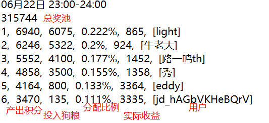

# 聚宝盆游戏

### 基本流程

1. 理论上玩家只能获得幸运奖
2. 幸运奖前6名**积分分配比例** 分别为 0.222%、0.20%、0.177%、0.155%、0.133%、0.111%
3. 由于积分是阶梯分配的，所以有一定的可操作空间：只比你的下一位多一点点，即可获得积分分配比例的差值

> 实际收益  =  产出积分 - 投入狗粮 （积分-狗粮兑换比例1:1）

4. 如何精确获得所有玩家的投入数：  游戏下方有 XXX 投入了 Y 克狗粮，访问其接口`https://jdjoy.jd.com/pet/getPetTreasureBox`并将用户及其投入的狗粮数存入数据库；经观察，每秒访问一次，一小时内误差少于100狗粮，足够了
5. 这样，在每个回合的最后几分钟内即可判断是否出手

### 难点一：时刻运行

有云服务器就行，设置好数据库，注意去重，就可以跑了

### 难点二：自动出价策略

1. 大部分玩家都会在最后一段时间内出价，因此需要判断继续追加或者止损放弃

2. 每次`investTreasure`有一定的时间间隔，约为0.8秒，否则失败

3. 不排除有同样策略的玩家，那就比拼出价策略和网速吧

## 总结 

知道了分配比例后，简单计算就可以明确投入的上限；

如果想以小博大，以最小的投入换取最大的收益，就需要监控每个玩家的出价，需要云服务器和数据库；

如果担心以小博大时被他人反超，就需要设计一个合格的出价策略。